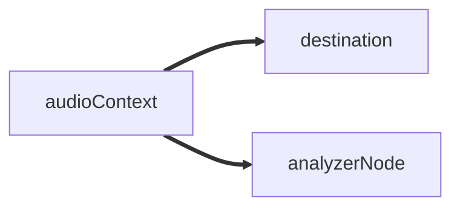

## Introduction

So I always take tangents when learning something new. Right now I am focusing on getting through a Data Structures
and Algos Book, but I stumbled on a course for web audio synthesis using javascript. I've decided to do a couple of 
classes tonight. I am on a lesson about creating a meter visualization. The basic project looks like this:

<video src="https://emanuelrgz-content.sfo3.cdn.digitaloceanspaces.com/videos/2023-09-16%2001-59-12.mp4" controls="controls" style="max-width: 730px;"></video>


Kinda cool, but I want to make the outline of the circle be frequency of the signal and I think it would also be 
really cool to add some color to represent the singal amplitude. So here we go, lets learn this.


```javascript
let audioContext;
let audio;
let signalData;
let analyserNode;

function mousePressed() {
  if (!audioContext) {
    // set up audio context and start playing
    audioContext = new AudioContext();
    audio = document.createElement("audio");
    audio.src = "audio/01 Xtal.mp3";
    audio.loop = true;
    audio.play();

    // create source and connect to speakers and analyser node
    const source = audioContext.createMediaElementSource(audio);
    analyserNode = audioContext.createAnalyser();
    analyserNode.smoothingTimeConstant = 1;
    signalData = new Float32Array(analyserNode.fftSize);
    source.connect(audioContext.destination);
    source.connect(analyserNode);
  } else {
    // pause audio
    if (audio.paused) audio.play();
    else audio.pause();
  }
}

function rmss(data) {
  let rms = 0;
  for (let i = 0; i < data.length; i++) {
    rms += data[i] * data[i];
  }

  return Math.sqrt(rms / data.length);
}

function setup() {
  createCanvas(windowWidth, windowHeight);
}

function windowResized() {
  resizeCanvas(windowWidth, windowHeight);
}

function draw() {
  background("black");
  const dim = min(height, width);

  if (audioContext) {
    analyserNode.getFloatTimeDomainData(signalData);

    const signal = rmss(signalData);
    const scale = 3;
    const size = dim * scale * signal;

    stroke("white");
    noFill();
    strokeWeight(dim * 0.0075);
    circle(width / 2, height / 2, size);
  } else {
    fill("white");
    noStroke();
    polygon(width / 2, height / 2, dim * 0.1, 3);
  }
}

function polygon(x, y, radius, sides = 3, angle = 0) {
  beginShape();
  for (let i = 0; i < sides; i++) {
    const a = angle + TWO_PI * (i / sides);
    let sx = x + cos(a) * radius;
    let sy = y + sin(a) * radius;
    vertex(sx, sy);
  }
  endShape(CLOSE);
}

```

## Initial Code Breakdown

Let's break down the initial code that is present in the course, to first make sure I understand it, and 
also point out where I think my features will have to be fit in.

### Overall Structure

The overall structure of the code can be broken down into a few functions, 

- `setup()`
- `draw()`
- `mousePressed()`

all the other functions are either helper functions, or in the case of the `windowResized()` help with ui.

### setup

A lot these functions are functions from the __p5.js__ library that is being used here to create the environment we draw
on. 

We start with a call to `setup()`, set up as you may have guessed gets called to set up the environment, we simply 
call `createCanvas` and pass in the width and height of our window with to p5 constants `windowWidht` and `windowHeight`.
We could have defined additional environment properties, like background color.

### draw

The `draw()` function is called immediately after `setup`, and it keeps executing. Our draw function, 

```javascript
function draw() {
  background("black");
  const dim = min(height, width);

  if (audioContext) {
    analyserNode.getFloatTimeDomainData(signalData);

    const signal = rmss(signalData);
    const scale = 3;
    const size = dim * scale * signal;

    stroke("white");
    noFill();
    strokeWeight(dim * 0.0075);
    circle(width / 2, height / 2, size);
  } else {
    fill("white");
    noStroke();
    polygon(width / 2, height / 2, dim * 0.1, 3);
  }
}
```

on first run draw will define the background to be black and we define the dim to be minimum of either
width or height. The function will then jump to the `else` case since we have no `audioContext` set up just yet.
In the else we simply draw triangle to represent the play button. Rember that this draw function will get 
called over and over again.


### mousePressed 

This function gets called when we click the mouse (anywhere on the sreen). This function will either play or pause the audio, 
on first run we will initialize a few of the global variables including the `audioContext` we saw back in the `draw` function.
Here is our function again:

```javascript
function mousePressed() {
  if (!audioContext) {
    // set up audio context and start playing
    audioContext = new AudioContext();
    audio = document.createElement("audio");
    audio.src = "audio/01 Xtal.mp3";
    audio.loop = true;
    audio.play();

    // create source and connect to speakers and analyser node
    const source = audioContext.createMediaElementSource(audio);
    analyserNode = audioContext.createAnalyser();
    analyserNode.smoothingTimeConstant = 1;
    signalData = new Float32Array(analyserNode.fftSize);
    source.connect(audioContext.destination);
    source.connect(analyserNode);
  } else {
    // pause audio
    if (audio.paused) audio.play();
    else audio.pause();
  }
}
```

So at the top of the file we `let` a bunch of variables that are all set to `undefined`, we initialize most of them here.

#### AudioContext

The most important and where it all starts is with the `audioContext`

From MDN:

> The AudioContext interface represents an audio-processing graph built from audio modules linked together, each represented by an AudioNode. 
An audio context controls both the creation of the nodes it contains and the execution of the audio processing, or decoding. 
You need to create an AudioContext before you do anything else, as everything happens inside a context. It's recommended 
to create one AudioContext and reuse it instead of initializing a new one each time, and it's OK to use a single AudioContext
for several different audio sources and pipeline concurrently.

Therefore we start by creating a new one with `audioContext = new AudioContext();`. Next we create an `<audio>` element on the DOM and make a reference
to it with the variable `audio`. We set some initial properties to this element and start playing with `.play()`.
Next we connect our `audioContext` to the audio element we created on the DOM and set up some variables to start extracting data from 
this signal.

These lines will create a new Analyser Node that we will use to extract frequency data from the audioContext.

```javascript 
analyserNode = audioContext.createAnalyser();
analyserNode.smoothingTimeConstant = 1;
signalData = new Float32Array(analyserNode.fftSize);
```

lastly we connect the `source`, which is the audio being streamed to 1) the destination (speakers/headphones) and 2) the analyser node
that we want to use to extract data for visualizations.

```javascript
source.connect(audioContext.destination);
source.connect(analyserNode);
```

The flow audio data is shown here:



<!--  -->

### draw revisited

At this point our `audioContext` is no longer undefined and so lets step through the `draw` function again.

```javascript
if (audioContext) {
  analyserNode.getFloatTimeDomainData(signalData);

  const signal = rmss(signalData);
  const scale = 1;
  const size = dim * scale * signal;

  stroke("white");
  noFill();
  strokeWeight(dim * 0.0075);
  circle(width / 2, height / 2, size);
}
```

Since we have data in the audioContext, we want to start by pulling out the time domain data, or waveform into a `FloatArray32` object, in this
case `signalData`. Next we pull out the root mean squared value from the signal and construct our circle using the width, height and 
a scaled version of the signal.


## Features to add

Here are the features I want to add to this example

1. Add Color
2. Add frequency spectrum to the outline of the circle


### Add Color

I want the color to change with the meter, the place to start it looks like is the `strok("white")`, we need to make thi dynamic. I will
use the p5 function map, it takes an incoming value and maps it to a new range, in this case we are taking the signal data, we tell it that it 
ranges from 0 to 0.5 and we want to remap these values to -50 to 200 for red and 200 to -30 for blue. The rest is just adding these offsets
to the `stroke` call.

```javascript 
const redOffset = map(signal, 0, 0.5, -50, 200);
const blueOffset = map(signal, 0, 0.5, 255, -30);

stroke(Math.min(50 + redOffset, 256), 10, 0 + blueOffset);
```

We now get something like this

<video src="https://emanuelrgz-content.sfo3.cdn.digitaloceanspaces.com/videos/js-meter-with-color.mp4" controls="controls" style="max-width: 730px;"></video>


Ok so I was unable to figure out the frequency outline for the circle but I put together something that looks pretty cool I think.


<video src="https://emanuelrgz-content.sfo3.cdn.digitaloceanspaces.com/videos/js-meter-with-fill.mp4" controls="controls" style="max-width: 730px;"></video>
